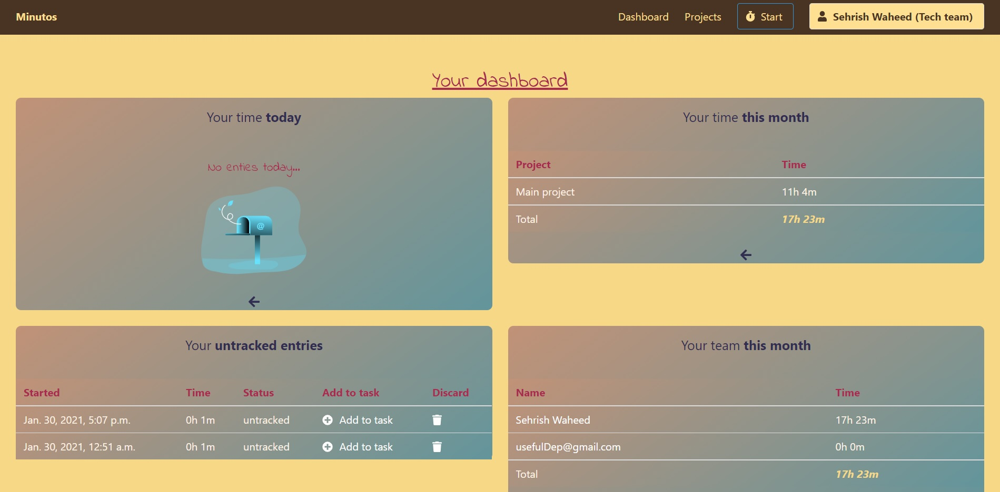
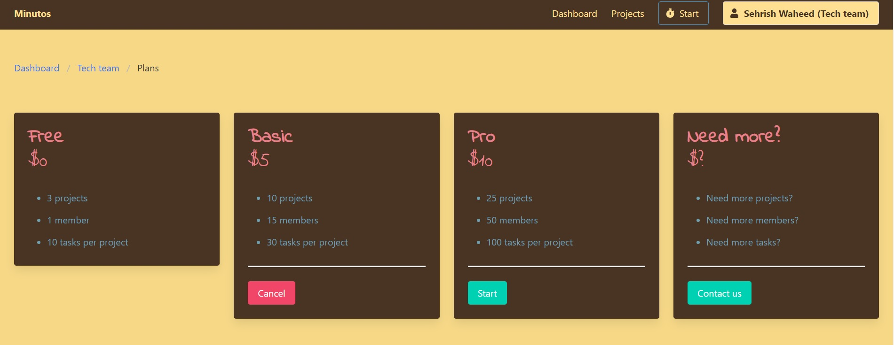
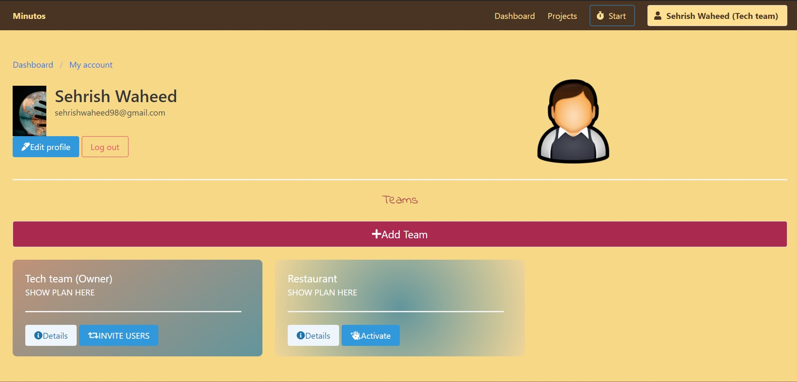

**TimeTracking Saas Web App**

👉WELCOME SCREEN

👉USERS DASHBOARD

👉SUBSRIPTION PLAN

👉USER PROFILE

👉USER PROJECTS

**Description**
Web app where teams can manage their time subscibing to services provided by the app.
Payments are made via stripe.
App will list all the set tasks for the project and their details. Team members can track their tasks and add status to their tasks.
Team members can register entries to the task and trace total time on the task list.
Team leader can invite more team members via emails.Teams can subscribe or unsubscribe any time from their plans.
